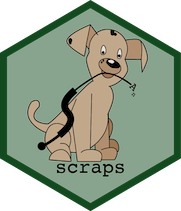
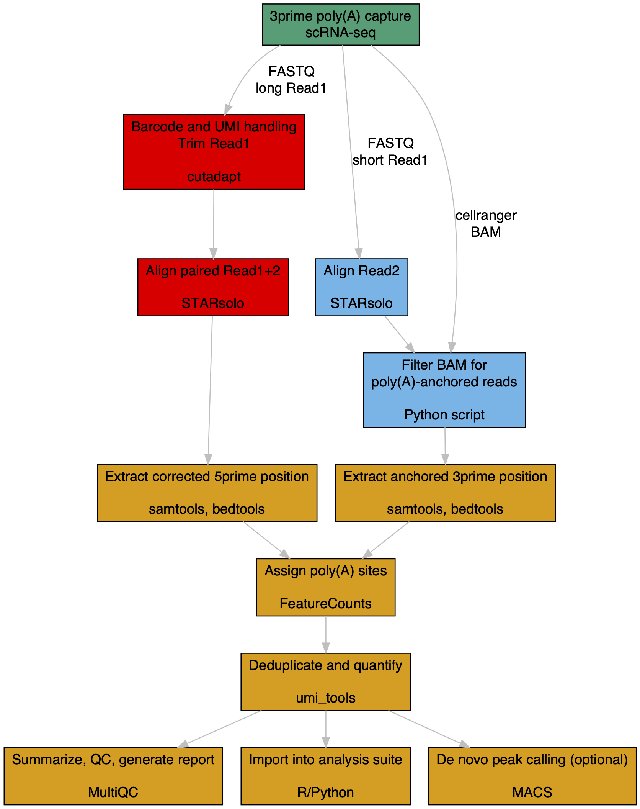
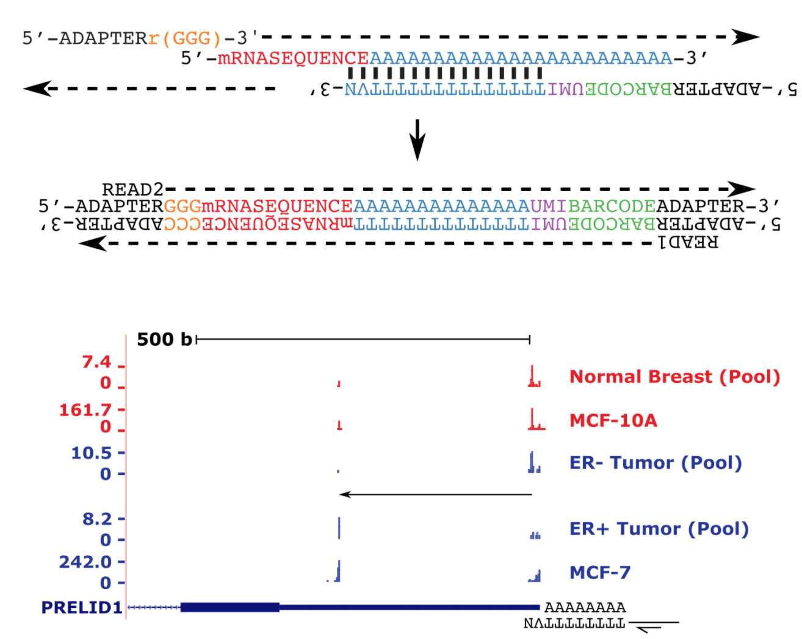
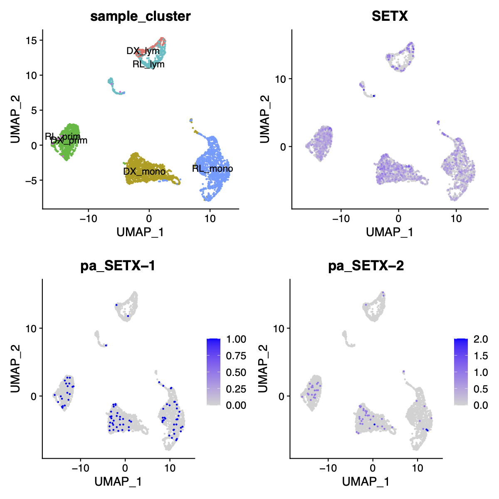
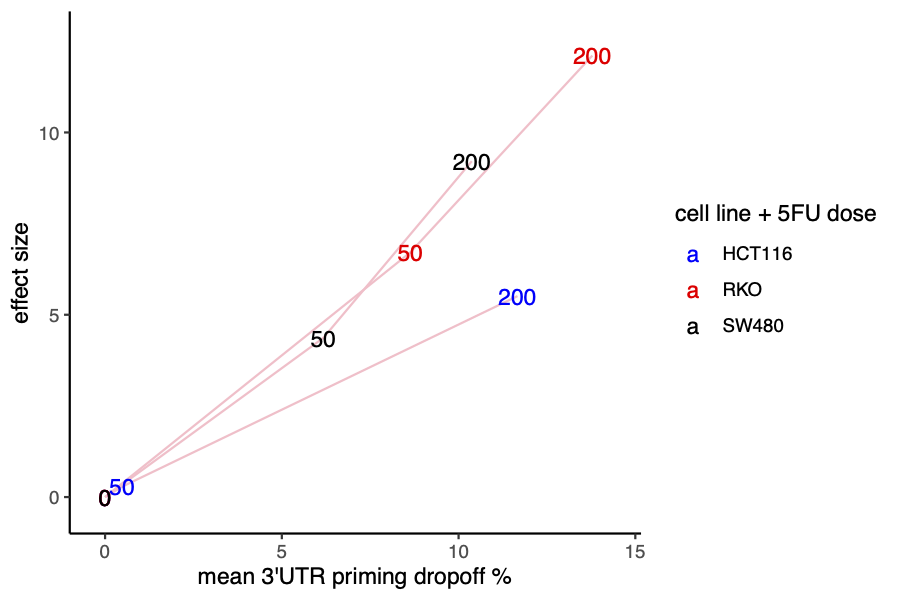

# scraps 

<!-- badges: start -->


<!-- badges: end -->

### scraps extracts mRNA polyadenylation sites from "TVN"-primed single-cell RNA-seq libraries at near-nucleotide resolution.

scraps (**S**ingle **C**ell **R**N**A** **P**olyA **S**ite Discovery) is currently implemented as a <a href="https://snakemake.readthedocs.io/en/stable/">Snakemake</a> pipeline for 
10X Genomics 3' end v2/3 libraries (and other platforms with similar library structure, including Drop-seq, 
Microwell-seq, and BD Rhapsody). If long Read1 is available (estimated ~6% of SRA-deposited data, or now planning new experiments), positional information will be calculated from paired realignment; otherwise, the less optimal anchored Read2 approach is used. scraps will eventually be expanded for analyzing a range of RNA processing 
changes in single-cell RNA-seq data.

For additional discussions and usage cases, please see [bioRxiv preprint](https://www.biorxiv.org/content/10.1101/2022.08.22.504859v1).



---
-   [Example usage](#example-usage)
-   [Supported scRNA-seq platforms](#supported-scrna-seq-platforms)
-   [Output](#output)
-   [Setup](#setup)
-   [Dependencies](#dependencies)
-   [Extended function](#bonus-function)
    
## Example usage

scraps requires the following as input (defined in config.yaml and sample_fastqs.tsv):

  - 10X Genomics 3' v2/3 single-cell FASTQs or other platforms (with names "_R1.fastq.gz"" and "_R2.fastq.gz"")
  - A STAR genome index (must be generated with STAR 2.7.4a and above)
  - Whitelist for cell barcodes (optional but recommended to speed up run time)
  - A featureCounts reference (SAF-formatted <a href="http://exon.umdnj.edu/polya_db/">polya_db</a>, hg38 and mm10 files are included in [ref](https://github.com/rnabioco/scraps/tree/master/ref) subdirectory)

To run test data, simply execute:
```
snakemake --snakefile Snakefile \
  --configfile config.yaml \
  --resources total_impact=5 \
  --keep-going
```
[DAG steps illustration](https://raw.githack.com/rnabioco/scraps/master/inst/dag.pdf)

[submit jobs in cluster mode](https://snakemake.readthedocs.io/en/stable/executing/cluster.html)

Notes: `total_impact` is set to 5 for each sample, change this to control how many samples are processed in parallel

---

## Supported scRNA-seq platforms
| Platform | Library (BC+UMI+A) | Setting | Test data |
| :--------|:------------| :------------| :---------|
| 10x Chromium V3 | [16 + 12 + 30](https://teichlab.github.io/scg_lib_structs/methods_html/10xChromium3.html) | chromiumV3 | ✓ |
| 10x Chromium V2 | [16 + 10 + 30](https://teichlab.github.io/scg_lib_structs/methods_html/10xChromium3.html) | chromiumV2 | ✓ |
| 10x Chromium Visium | [16 + 10 + 30](https://teichlab.github.io/scg_lib_structs/methods_html/10xChromium3.html) | visium | |
| Drop-seq | [12 + 8 + 30](https://teichlab.github.io/scg_lib_structs/methods_html/Drop-seq.html) | dropseq | ✓ |
| Microwell-seq | [6x3 + 6 + 30](https://teichlab.github.io/scg_lib_structs/methods_html/Microwell-seq.html) | microwellseq | ✓ |
| BD Rhapsody | [9x3 + 8 + 18](https://teichlab.github.io/scg_lib_structs/methods_html/BD_Rhapsody.html) | bd | |
| inDrop | [8 + 6 + 18](https://teichlab.github.io/scg_lib_structs/methods_html/inDrop.html) | indrop | |

Custom chemistry supported, by editing [chemistry.json](https://github.com/rnabioco/scraps/tree/master/chemistry.json). Also see synthetic FASTQ [tool](https://github.com/raysinensis/bc_umi_gen).

---

## Output
1. bedgraph : TVN-priming site pileup
```
chr11   215106  215107  1
chr11   689216  689217  1
chr11   812862  812863  1
chr11   812870  812871  2
chr11   812871  812872  2
```
2. count table : +-10 around PolyA_DB sites, by cell barcode
```
gene    cell    count
AC135178.2_NA_ENSG00000263809_chr17_8377523_-_Intron,RPL26_6154_ENSG00000161970_chr17_8377523_-_3'UTR(M)        AACTCCCGTTCCTCCA        1
AC135178.2_NA_ENSG00000263809_chr17_8377523_-_Intron,RPL26_6154_ENSG00000161970_chr17_8377523_-_3'UTR(M)        CCCATACGTTAAAGAC        1
AC135178.2_NA_ENSG00000263809_chr17_8377523_-_Intron,RPL26_6154_ENSG00000161970_chr17_8377523_-_3'UTR(M)        CGTCCATTCGACAGCC        1
ACTG1_71_ENSG00000184009_chr17_81509999_-_3'UTR(M)      ACATCAGGTGATGTCT        1
ADRM1_11047_ENSG00000130706_chr20_62308862_+_3'UTR(M)   CAGCGACTCTGCCCTA        1
```
3. [html report](https://raw.githack.com/rnabioco/scraps/master/inst/test_output/report/multiqc_report.html) : various metrics from steps in the pipeline

[R functions](https://github.com/rnabioco/scraps/tree/master/inst/scripts/R) available for importing results into Seurat object, and finding differential PA site usage. Alternatively, a package of the same functions can be installed with [`remotes::install_github("rnabioco/scrapR")`](https://github.com/rnabioco/scrapR)

<p float="left">
  
  
</p>

___

## Setup
1. Clone repository:
`
git clone https://github.com/rnabioco/scraps
`
2. Check dependencies (ideally with Conda, see below)
3. Place appropriate STAR index in `index/` folder, and barcode whitelists in `whitelist/` <br>Download links(all files need to be extracted): [GRCh38 index](https://scrapsaccessory.s3.us-west-2.amazonaws.com/GRCh38_cr2020A_star.tar.gz); [10x V2 barcodes](https://scrapsaccessory.s3.us-west-2.amazonaws.com/737K-august-2016.txt.gz); [10x V3 barcodes](https://scrapsaccessory.s3.us-west-2.amazonaws.com/3M-february-2018.txt.gz)
4. Edit settings in `config.yaml`
5. List files in `sample_fastqs.tsv`
6. Run!
(sample results can be found at [inst/test_output/](inst/test_output/))

___

## Dependencies

scraps requires the following executables in your PATH:

  - <a href="https://www.python.org">Python 3</a> (developed with version 3.8.5)
  - <a href="https://bitbucket.org/snakemake/snakemake/src/master">Snakemake</a> (developed with version 3.11.2)
  - <a href="https://github.com/CGATOxford/UMI-tools">UMI-tools</a> (developed with version 1.1.1)
  - <a href="https://cutadapt.readthedocs.io">cutadapt</a> (developed with version 3.4)
  - <a href="https://github.com/alexdobin/STAR">STAR</a> (developed with version 2.7.9a)
  - <a href="https://www.htslib.org">Samtools</a> (developed with version 1.3.1)
  - <a href="https://bedtools.readthedocs.io/en/latest">Bedtools</a> (developed with version 2.30.0)
  - <a href="http://subread.sourceforge.net">Subread</a> (developed with version 1.6.2)
  - <a href="https://multiqc.info">MultiQC</a> (developed with version 1.9)
  
Alternatively, we recommend using [Conda](https://docs.conda.io/en/latest/) to manage these dependencies, simply with:
`conda env create -f scraps_conda.yml` and then `conda activate scraps_conda`

Docker image for automated deployment can also be found at https://hub.docker.com/r/rnabioco/scraps.

Please also see the <a href="https://snakemake.readthedocs.io/en/stable/">Snakemake</a> documentation
for general information on executing and manipulating snakemake pipelines.

---

## Extended function



**1) Measuring internal priming as indicator of apoptotic cytoplasmic poly(A) RNA decay**

(Based on widespread RNA decay during apoptosis: [Liu and Fu et al.](https://www.sciencedirect.com/science/article/pii/S0092867418305105))

Use SAF (hg38 version provided in [ref](https://github.com/rnabioco/scraps/tree/master/ref) subdirectory) file marking all gene regions (5'UTR, intron, CDS, 3'UTR), and helper
[R functions](https://github.com/rnabioco/scraps/tree/master/inst/scripts/R/scraps_priming_region.R) to process output.

---

**2) Accurate intron/exon quantification for RNA velocity**

(See discussions on quantification approaches and pitfalls: [Soneson et al.](https://journals.plos.org/ploscompbiol/article?id=10.1371/journal.pcbi.1008585))

| Consideration | scraps |
|:--------|:------------|
| Avoid feature double-counting | ✓ |
| Take strandedness into account | ✓ |
| Avoid count substraction | ✓ |
| Resolve spliced vs unspliced target | ✓ |
| Speed | ✓ |
