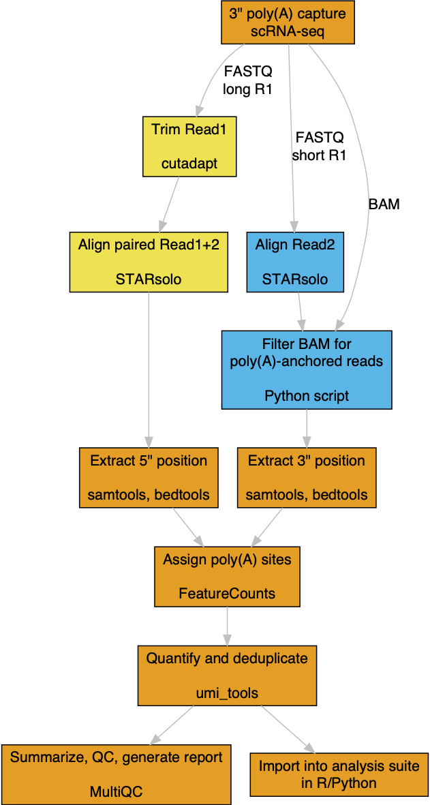

# scraps 

<!-- badges: start -->

<!-- badges: end -->

scraps (**S**ingle **C**ell **R**NA **P**rocessing **S**oftware) extracts
mRNA polyadenylation sites from "TVN"-primed single-cell RNA-seq libraries.

Currently implemented as a <a href="https://snakemake.readthedocs.io/en/stable/">Snakemake</a> pipeline for 
10X Genomics 3' end v2/3 libraries (and other platforms with similar library structure, including Drop-seq, 
Microwell-seq, and BD Rhapsody), scraps will eventually be expanded for analyzing a range of RNA processing 
changes in single-cell RNA-seq data.

## Dependencies

scraps requires the following executables in your PATH:

  - <a href="https://www.python.org">Python 3</a> (developed with version 3.8.5)
  - <a href="https://bitbucket.org/snakemake/snakemake/src/master/">Snakemake</a> (developed with version 3.11.2)
  - <a href="https://github.com/CGATOxford/UMI-tools">UMI-tools</a> (developed with version 1.1.1)
  - <a href="https://cutadapt.readthedocs.io">cutadapt</a> (developed with version 3.4)
  - <a href="https://github.com/alexdobin/STAR">STAR</a> (developed with version 2.7.9a)
  - <a href="http://subread.sourceforge.net">Subread</a> (developed with version 1.6.2)
  - <a href="https://multiqc.info">MultiQC</a> (developed with version 1.9)

## Example usage

scraps requires the following as input (defined in config.yaml):

  - 10X Genomics 3' v2/3 single-cell FASTQs 
  - Optional cell barcode whitelists for each sample, in FASTQ folder  (can be auto-generated in UMI-tools format, single column lists also compatible)
  - A STAR genome index (compatible with cellranger indices <a href="https://cf.10xgenomics.com/supp/cell-exp/refdata-gex-GRCh38-2020-A.tar.gz">GRCh38</a> and <a href="https://cf.10xgenomics.com/supp/cell-exp/refdata-gex-mm10-2020-A.tar.gz">mm10</a>)
  - A featureCounts reference (SAF-formatted <a href="http://exon.umdnj.edu/polya_db/">polya_db</a>, hg38 and mm10 files are included in ref subdirectory)

See the <a href="https://snakemake.readthedocs.io/en/stable/">Snakemake</a> documentation
for general information on executing and manipulating snakemake pipelines.

## Workflow

