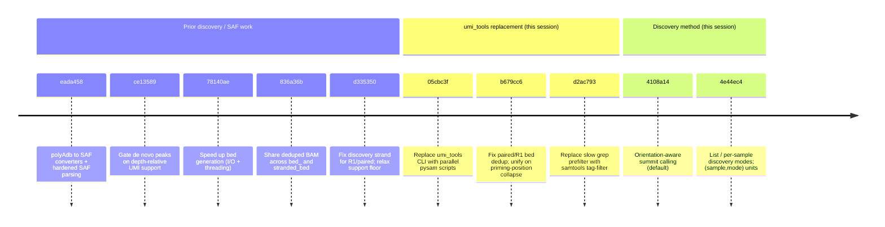
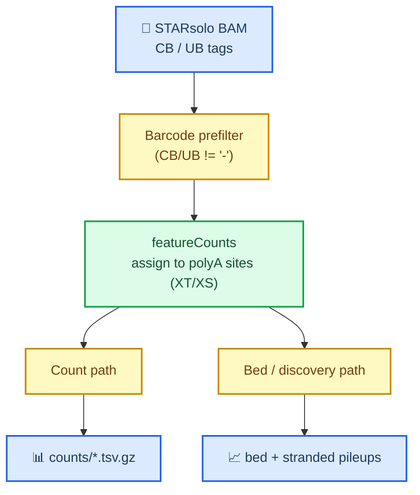
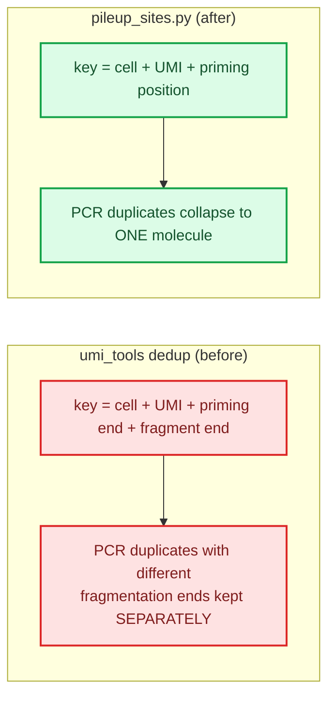
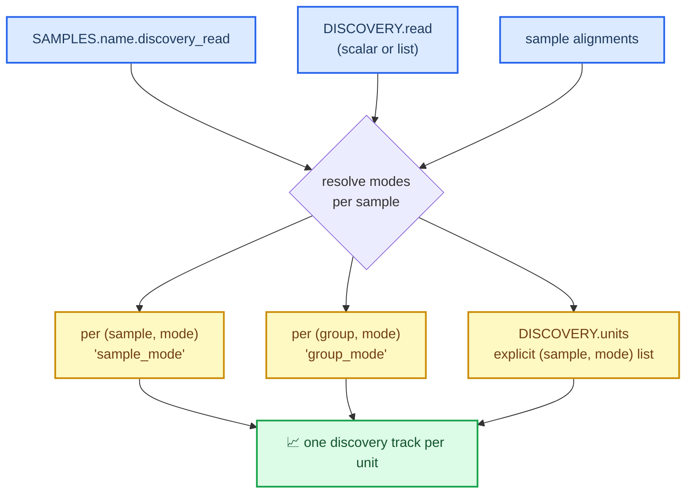

# scraps Pipeline Change Report — since `94e9782`

_Branch `replace-umitools-pysam`. Baseline commit `94e9782` ("Add de novo RT priming site discovery module", 2026-06-16). This report summarizes every change on the branch through commit `4e44ec4` (2026-07-11), combining the commit record with the design rationale developed during the work._

> **Superseded (later change):** the count-arm per-sample bed tracks (`{results}/bed/{sample}_{alignments}.bed.gz`, rules `bed_R1`/`bed_R2`/`bed_paired`) described below have since been **removed**. They were terminal, unstranded, and had no downstream consumers; strand-aware browser tracks are provided by the discovery arm's stranded beds, which are more correct for polyA data. In the same change, `pileup_sites.py` (now used only by discovery's `stranded_bed`) was rewritten from an in-RAM dedup dict to a sort-then-stream algorithm with O(1) resident memory, fixing an OOM on very large (hundreds-of-GB) assigned BAMs. Output remains byte-for-byte identical. References to the "bed path" in this historical report should be read with that removal in mind.

---

## 📌 Executive summary

Ten commits since the baseline reshaped the counting and discovery portions of the pipeline. The headline outcomes:

- **Both single-threaded `umi_tools` bottlenecks removed** and replaced with parallel `pysam` scripts. The count table is reproduced **bit-for-bit**; the bed/discovery pileups adopt a corrected, molecule-level deduplication.
- **Large speedups on a real 28M-read library:** UMI counting **92 s → 24 s** (8 threads), bed generation **604 s → 72 s**, and the barcode prefilter **311 s → 54 s**.
- **A corrected paired/R1 deduplication semantic** — collapse PCR duplicates by `(cell, UMI, priming position)` rather than by fragment span — that also makes the bed pileups consistent with the count table.
- **A more accurate discovery summit caller** that snaps the called site onto the cleavage boundary; exact agreement with polyAdb rose from **~39% to ~76%**.
- **Flexible discovery modes:** a single mode, a list of modes, per-sample overrides, and arbitrary `(sample, mode)` pooling units.
- Supporting work: polyAdb→SAF converters, hardened SAF parsing, depth-relative peak gating, and a synthetic + real-data validation harness.

> ⚠️ **Correctness posture.** Count tables are bit-identical to the previous pipeline. Bed and discovery outputs change by design (molecule-level dedup and a new summit rule); both changes were validated and are documented below.

---

## 🗂️ Commit timeline

_Chronological list of the ten commits between the baseline and the branch head. The final four (bottom of the diagram) were produced during the working session that this report accompanies._

---

## 🔬 The counting pipeline before and after

_The assign → count → bed data flow. featureCounts is retained; the two `umi_tools` invocations and the slow prefilter are replaced._

| Step | Before (`94e9782`) | After (branch head) | Result |
| --- | --- | --- | --- |
| Barcode prefilter | `samtools view -h \| grep -v 'CB:Z:-\|UB:Z:-' \| samtools view -b` | `samtools view -e '[CB]!="-" && [UB]!="-"'` | 311 s → 54 s (5.8×), read set bit-identical |
| Site assignment | featureCounts | featureCounts (unchanged) | ~25 s; retained deliberately |
| UMI count | `umi_tools count` (single-thread) | `count_sites.py` (pysam, per-contig parallel) | 92 s → 24 s, **bit-identical** |
| Dedup + pileup | `umi_tools dedup` + `bedtools genomecov` | `pileup_sites.py` (single pass) | 604 s → 72 s, corrected semantics |

---

## ⚙️ Replacing umi_tools with pysam

Commits `05cbc3f`, `b679cc6`, `d2ac793`.

### Why

Both `umi_tools count` and `umi_tools dedup` are single-threaded and were the dominant runtime cost. `featureCounts`, by contrast, is only ~25 s and mature, so it was kept; a bit-exact reimplementation was judged not worth the risk.

### count_sites.py — bit-exact directional counting

`umi_tools count` runs the **directional** UMI-network method by default (not plain unique counting). To reproduce it exactly, `count_sites.py` groups reads by `(cell, featureCounts XT site)` and calls **umi_tools' own `UMIClusterer`** per group, parallelized across contigs. Reusing the library guarantees the directional collapse matches. On real data the output was bit-identical (1,721,298 rows; sum 26,098,359).

### pileup_sites.py — corrected molecule dedup

The bed path replaces `umi_tools dedup --method=unique` + `genomecov`. The key semantic question surfaced on real paired data:

The opposite (non-priming) end of a molecule is set by **fragmentation after PCR amplification**, so reads sharing a cell, UMI, and priming site but differing at that end are PCR duplicates of one molecule. `umi_tools` re-inflates them; `pileup_sites.py` deduplicates on `(cell, UMI, priming position)` uniformly across R1/R2/paired, which is both correct for the chemistry and consistent with the count table. Non-proper-pair reads are discarded to match the legacy read set.

> This reduced the discovery stranded-bed signal by ~37% on the real AEG1 library — larger than the ~3.7% seen on sparse synthetic data because real libraries have a much higher PCR-duplicate multiplicity. The effect is the intended correction, not a regression.

### Benchmark

_Runtime on the AEG1 28M-read paired library (24 GB machine). Lower is faster._

```mermaid
xychart-beta
    title "Runtime before vs after (seconds)"
    x-axis ["count", "bed", "prefilter"]
    y-axis "Seconds" 0 --> 650
    bar [92, 604, 311]
    bar [24, 72, 54]
```

| Path | Before (s) | After (s) | Speedup |
| --- | --- | --- | --- |
| UMI count | 92 | 24 (8 threads) | 3.8× |
| Bed / dedup pileup | 604 | 72 | 8.4× |
| Barcode prefilter | 311 | 54 | 5.8× |

---

## 🎯 Orientation-aware summit calling

Commit `4108a14`.

### The problem

3'-end read pileups have a **hard boundary at the cleavage site** and **tail upstream** (transcript orientation). A Gaussian KDE places the summit at the smoothed centre of mass — ~1–2 bp upstream of the true cleavage site — and matched the polyAdb position exactly only ~39% of the time.

### The fix

KDE is retained for **cluster detection and UMI support** (the called site set is unchanged), but the **summit within each cluster** is now placed by a new rule: the most-downstream (transcript-3') base whose depth is at least `summit_frac` × cluster peak depth, searched over the full occupied read pileup. This snaps the summit onto the cleavage boundary. `summit_frac = 0.75` was chosen by sweeping 0.3–1.0 against polyAdb. Both methods remain available via `DISCOVERY.summit_method` (`downstream` default, `kde` legacy).

_Summit accuracy vs polyAdb cleavage points (`known_pas`), same 277,929 sites called by both methods. Higher exact-match is better._

```mermaid
xychart-beta
    title "Summit accuracy vs polyAdb (percent within offset)"
    x-axis ["exact (0 bp)", "within 1 bp", "within 2 bp"]
    y-axis "Percent of sites" 0 --> 100
    bar [39.2, 61.9, 77.9]
    bar [75.8, 77.5, 82.7]
```

| Method | Exact (0 bp) | ≤1 bp | ≤2 bp | Mean offset |
| --- | --- | --- | --- | --- |
| `kde` (legacy) | 39.2% | 61.9% | 77.9% | −1.12 bp |
| `downstream` (0.75, default) | **75.8%** | **77.5%** | **82.7%** | **−0.43 bp** |

---

## 🧭 Flexible discovery modes

Commit `4e44ec4`.

The single scalar `DISCOVERY.read` became a flexible scheme. Modes per sample resolve as: per-sample `discovery_read` override → global `read` (scalar or list) → the sample's own `alignments`, then intersected with what the sample was actually aligned in.

- **Per `(sample, mode)`** — default track `<sample>_<mode>`.
- **Per `(group, mode)`** — `DISCOVERY.groups` pools member samples within each shared mode → `<group>_<mode>`.
- **Explicit `DISCOVERY.units`** — aggregate an arbitrary list of `(sample, mode)` beds, across samples and/or modes.

Because stranded beds share a common transcript-oriented coordinate system, any set can be summed. **Caveat:** pooling multiple modes derived from the same underlying reads double-counts UMI support; only pool independent measurements. Existing scalar-`read` and `groups` configs keep working; the only behavioral change is that per-sample tracks are now mode-suffixed.

---

## 🧪 Validation

_How each output class is guarded. Count tables must be bit-exact; beds follow a directional criterion since their semantics intentionally changed._

| Output | Criterion | Status |
| --- | --- | --- |
| `counts/*.tsv.gz` | Bit-identical to `umi_tools count` | ✅ verified (real + synthetic) |
| `bed/*` and stranded beds | Directional: no new positions, `new_sum ≤ old_sum` | ✅ verified (real + synthetic) |
| Discovery summit | Offset vs polyAdb tightened, site set unchanged | ✅ verified on AEG1 |
| Snakemake DAG | `snakemake -npr` clean across mode scenarios | ✅ 0 errors |

Supporting harness added this branch: `tests/generate_synthetic.py` (synthetic assigned BAMs with soft-clips, splices, PCR-duplicate and non-proper-pair edge cases), `tests/validate_synthetic.sh`, and `tests/validate_realdata.sh` (old-vs-new diff on a real run).

---

## 📁 Files changed

_Aggregate diffstat across all ten commits: 22 files, +2,307 / −239 lines._

| Area | Files |
| --- | --- |
| New pysam scripts | `inst/scripts/count_sites.py`, `inst/scripts/pileup_sites.py` |
| Discovery caller | `inst/scripts/kde_peaks.py`, `inst/scripts/annotate_sites.py` |
| polyAdb converters | `inst/scripts/polyadb/{pas32_to_saf,pasv4_to_saf,saf_common,validate_saf}.py`, `polyadb/README.md` |
| Workflow rules | `Snakefile`, `rules/count.snake`, `rules/discovery.snake`, `rules/check_versions.snake` |
| Config / docs | `config.yaml`, `docs/discovery.md`, `AGENTS.md`, `README.md` |
| Tests | `tests/generate_synthetic.py`, `tests/validate_synthetic.sh`, `tests/validate_realdata.sh` |
| Environment | `scraps_conda.yml` |
| R helper | `inst/scripts/R/scraps_to_seurat.R` |

---

## ✅ Net assessment

The branch removes the pipeline's real runtime bottlenecks while keeping the primary quantitative output (the count matrix) bit-identical. The bed and discovery changes are deliberate scientific corrections — molecule-level deduplication and cleavage-boundary summit placement — each validated against real data and polyAdb, and each documented with its caveats. Discovery configuration is now substantially more flexible without breaking existing configs.
